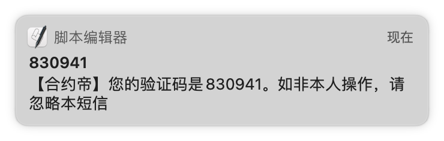
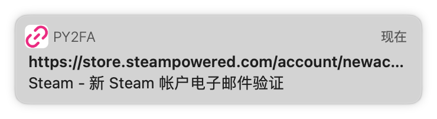
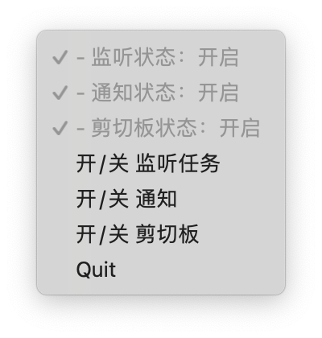

# PY2FA - 全功能两步验证工具
在macOS上实时获取iOS设备短信中的验证码并自动拷贝至剪切板；

实时获取邮箱中的验证码、两步验证链接并自动拷贝至剪切板


## 用法
1. 下载[最新版本](https://github.com/TeavenX/py2fa/releases)解压后拖入应用程序文件夹
2. 在用户目录（/Users/你的用户名/config.yaml）创建config.yaml文件，拷贝以下配置
```yaml
email:
  - username: your username@qq.com
    password: your password
  - username: 你的邮箱@gmail.com
    password: 你的密码
    pop_server: 邮箱的pop3服务地址，选填，默认取邮箱后缀

white_domain: # 选填 TODO：没有激活白名单功能
  - store.steampowered.com

bark_url: # 选填 目前没有激活bark通知功能
  - https://api.day.app/你的bark app的订阅地址/
```
3. 将email中的配置改成你对应的配置，一般的邮箱都需要在网页邮箱上手动开启pop3，有部分邮箱还会要求设置独立密码，例如QQ邮箱和Gmail。
如果使用Gmail的账户密码登录，需要开启`安全性较低的应用的访问权限`（<font color = 'orange'>不建议</font>），推荐开启两步验证后，设置Gmail独立密码后填入配置中，参考[使用应用专用密码登录](https://support.google.com/accounts/answer/185833)

4. 配置完成后打开软件可以在菜单栏看到图标


借助菜单栏按钮可以控制每个功能的开关，启动时默认所有功能打开，如果有隐私和安全性考虑可以手动关闭对应功能


## 注意事项
短信验证码不需要额外配置，只需要确保iOS和macOS上登录的是同一个iCloud账号，且Handoff都处于打开的状态

本软件完全开源，个人配置离线保存在本地，可以放心使用。也支持用源码自己构建打包，打包命令
```bash
pip install -r requirements.txt
python setup.py py2app
```

## GPL License

---

# English Version

# PY2FA - fully function tool for 2 factor authcation
Automaticly monitor and copy 2fa code from message and email


## Usage
1. Download the [latest version](https://github.com/TeavenX/py2fa/releases), unzip and drag PY2FA.app to Application folder.
2. Create a config.yaml in User root folder(/User/YOUR USERNAME/config.yaml), copy and modify config blow
```yaml
email:
  - username: your username@qq.com
    password: your password
  - username: 你的邮箱@gmail.com
    password: 你的密码
    pop_server: pop3 server url, optional, email suffix default

white_domain: # optional TODO: white list is currently inactive
  - store.steampowered.com

bark_url: # optional TODO: bark notify is currently inactive
  - https://api.day.app/your bark app webhook url/
```
3. You must turn on POP3 protocol in email-provider web setting. if it's Gmail, you may need to turn on `less secure apps` which is <font color='orange'>not recommended</font>. The better way is turn on 2fa for your Gmail account and set up [Sign in with App Passwords](https://support.google.com/accounts/answer/6010255?p=less-secure-apps&hl=zh-Hans&visit_id=637595421375318674-3339552613&rd=1), and fill in config.yaml with the specified Gmail password.

4. After step3 you can open the PY2FA.app, and there will a icon in the menu bar


You can easily turn on/off the notification/clipboard function if you worry about security or your privacy.


## Notes
2fa message is already setup while the app start, however make sure the Handoff setting is On on your ios devices and Mac

Your profile or config are safed in your Mac offline.

The app is totally open source(GPL License), you can package a complete app on your own.
```bash
pip install -r requirements.txt
python setup.py py2app
```

## GPL License